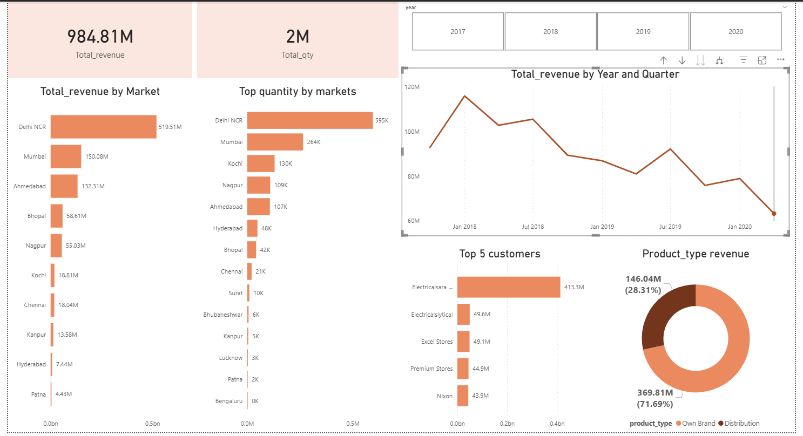

📊 Sales Insights Dashboard - Power BI Project

🔍 Project Overview
This project is an end-to-end Sales Insights Data Analysis built using MySQL and Power BI.
The goal is to analyze sales performance across different markets, customers, and product types
to help businesses make data-driven decisions.

🛠️ Tools & Technologies Used
MySQL Workbench – Database creation, data import, and SQL querying
Power BI Desktop – Data connection, transformation, and visualization
Power Query – Data cleaning and transformation
SQL – Data extraction and analysis

Project Workflow
1️⃣ Data Import (MySQL)

Created a sales database in MySQL Workbench
Imported SQL dump file containing all 5 tables
Verified data integrity using basic SQL queries

SQL Analysis
Performed exploratory queries in MySQL:
-- Total revenue in Chennai
SELECT SUM(sales_amount) FROM transactions
WHERE market_code = 'Mark001';

-- Count of transactions
SELECT COUNT(*) FROM transactions;

-- Revenue by market
SELECT market_code, SUM(sales_amount) as Total_Revenue
FROM transactions
GROUP BY market_code
ORDER BY Total_Revenue DESC;

3️⃣ Power BI Connection

Connected Power BI Desktop to MySQL using MySQL Connector/NET
Imported all 5 tables into Power BI

4️⃣ Data Cleaning (Power Query)

Removed duplicate and null records
Filtered out invalid transactions (zero/negative sales amounts)
Handled currency normalization (INR and USD)
Established relationships between tables

5️⃣ Data Visualization
Built an interactive dashboard with the following visuals

💡 Key Insights
Delhi NCR is the highest revenue-generating market with ₹519.51M
Electricalsara Stores is the top customer contributing ₹413.3M in revenue
Own Brand products generate 71.69% of total revenue vs 28.31% for Distribution
Revenue shows a declining trend from 2018 to 2020, indicating potential business challenges
Delhi NCR and Mumbai together account for the majority of sales quantity

📚 Learnings from This Project

Connecting SQL databases to Power BI
Data cleaning and transformation using Power Query
Creating calculated measures for KPIs
Building interactive dashboards with slicers and filters
Deriving business insights from raw sales data

👤 Author
Srinithi

🎓 B.Tech Computer Science Student
🎯 Aspiring MBA in Business Analytics & Finance
🔗 GitHub: srinithiambi-analysis
